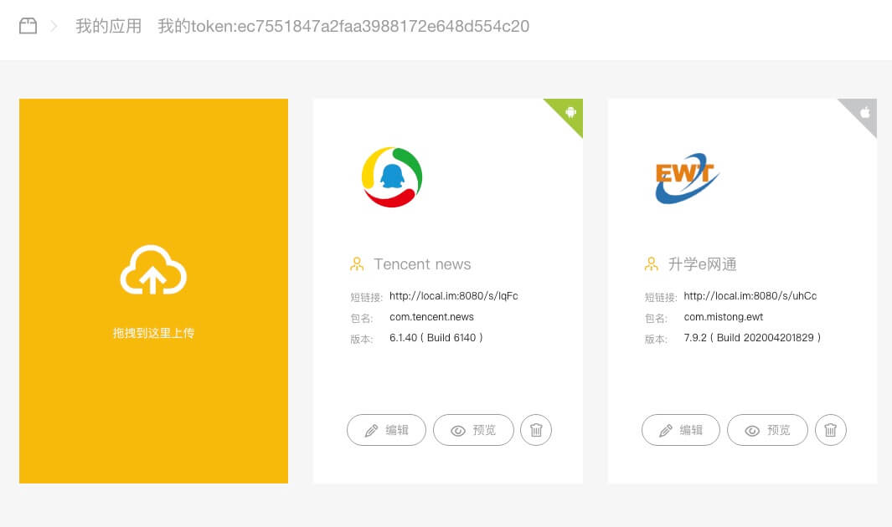
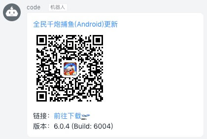

# 安装指南

#### 介绍
本项目使用 Spring Boot 开发的类似蒲公英和fir的企业内网 APP 分发平台，解决下载限制，实名认证等繁琐过程。

#### 效果

样式与 fir 一致，直接扒的。

##### 首页



##### 更新列表


##### 基本信息


##### 钉钉集成


##### 钉钉机器人消息



##### PC安装页


##### 手机安装页


##### Jenkins 集成效果


##### 证书信任设置


#### 安装教程

项目使用 JAVA 开发，需要 JDK 1.8 运行环境，数据库使用的是 Mysql，需要安装 Mysql。JDK 安装直接找网上教程。

##### 数据库

>  Mac 下安装 MySQL

```shell
brew install mysql
# 后台运行 mysql
mysqld &
# 登录 mysql
mysql -u root -p
```

> 建库

```shell
# 创建库
drop database if exists app_manager;
drop user if exists 'app_manager'@'localhost';
-- 支持emoji：需要mysql数据库参数： character_set_server=utf8mb4
create database app_manager default character set utf8mb4 collate utf8mb4_unicode_ci;
use app_manager;
create user 'app_manager'@'localhost' identified by 'app_manager123456';
grant all privileges on app_manager.* to 'app_manager'@'localhost';
flush privileges;
```

##### HTTPS 证书

参考 [Spring Boot Https 证书](Spring_Boot_Https_证书.md) 创建证书，本项目使用的是 `pckcs12`，密码使用的是 `123456`，部署项目时证书需要自己创建。

##### 配置

 [下载](https://share.weiyun.com/5zRBCtF)，解压包。

> 配置 HTTPS

将上一步生成的 ca.crt 放入 `/static/crt/` 目录中，替换掉里面的 ca.crt，将上一步生成的 `server.pckcs12` 文件替换掉包中的原有文件。

如果生成的证书密码不是 `123456`，需要修改`/config/application.properties` 中的 `server.ssl.key-store-password`字段的值为自已设定的密码

> 修改域名

使用文本编辑器打开 `/config/application.properties`，将 `server.domain`字段修改为部署服务器的 IP 或域名。

#### 部署

本项目使用的是 80 和 443 端口，确保端口未被占用。可以配置文件中更改为别的端口。

> 启动服务

```shell
java -jar intranet_app_manager-1.0.0.jar
```

服务启动后即可输入你的 IP 或域名来访问。

> 上传与安装

可以将 ipa 或 apk 拖入上传块中进行上传，上传完成后会在列表中展示。

**注意**

本项目默认采用 http 方式访问，这样可以避免没必要的证书信任。iOS 安装需要使用 https 协议，由于内网部署是用的自建证书，需要将 ca 添加到设备的信用列表中才可正常进行安装。**设置抓包代理会影响自建证书**，导致无法下载。

#### Jenkins 集成 

集成会用上 Jenkins 展示 HTML，需要在 Jenkins 配置中打开 HTML 展示


> 上传脚本

```shell
# 上传到APP管理平台
result=$(curl -F "file=@$WORKSPACE/build/Ewt360_debug/Ewt360.ipa" -F "token=ec7551847a2faa3988172e648d554c20" http://172.16.241.203/app/upload)
code_url=$(echo $result | sed 's/.*\(http.*\)",.*/\1/g')
echo "code_url="$code_url > $WORKSPACE/code.txt
```

> 注入变量

Properties File Path:`$WORKSPACE/code.txt`

> 展示二维码

Description: `<a href="${code_url}" target="_blank"></a>`


#### Jenkins 同机部署：按路径导入

当 Jenkins 与 APP 管理服务能访问同一个文件系统时，不必再次上传 APK/IPA 内容。先在
`application.properties` 中启用本机导入，并将允许目录限制为 Jenkins 工作目录：

```properties
package-import.enabled=true
package-import.allowed-roots=/var/lib/jenkins/workspace
package-import.token=${PACKAGE_IMPORT_TOKEN:}
package-import.max-file-size-bytes=1073741824
package-import.max-archive-entries=20000
package-import.max-extracted-size-bytes=2147483648
package-import.min-free-space-bytes=21474836480
```

`PACKAGE_IMPORT_TOKEN` 应使用独立的 Jenkins Secret Text 凭据提供，例如用
`openssl rand -hex 32` 生成；不要复用用户上传 token，也不要提交到代码仓库。

Jenkins 构建完成后只发送文件路径和元数据（请求中不包含安装包内容）：

```shell
result=$(curl -sS --fail-with-body -X POST \
  -H "Host: app-manager.example.com" \
  -H "X-Forwarded-Proto: https" \
  -H "X-Package-Import-Token: $PACKAGE_IMPORT_TOKEN" \
  --data-urlencode "filePath=$WORKSPACE/build/Ewt360_debug/Ewt360.ipa" \
  --data-urlencode "token=$APP_UPLOAD_TOKEN" \
  --data-urlencode "jobName=$JOB_NAME" \
  --data-urlencode "buildNumber=$BUILD_NUMBER" \
  http://127.0.0.1:8444/app/import)
code_url=$(printf '%s' "$result" | jq -er 'select(.code == 0) | .data')
echo "code_url=$code_url" > "$WORKSPACE/code.txt"
```

`APP_UPLOAD_TOKEN` 是业务用户 token，与独立的 `PACKAGE_IMPORT_TOKEN` 不同。
示例中的 `8444` 是本机 Nginx 的 HTTP 后端端口，请按实际部署替换。

如果已有域名和可信 HTTPS 证书，可由域名入口终止 TLS，再通过 HTTP 转发到宿主机，
不需要给宿主机配置自签证书。APP 管理服务本身仍可仅监听 `127.0.0.1:8090`。
反向代理必须向服务传递公开域名的 `Host` 和 `X-Forwarded-Proto: https`；
`storage.local.address` 也应配置为公开的 `https://app-manager.example.com/fetch/`。
本机 `/app/import` 建议在代理层限制为仅允许回环地址访问。

HTTP 仅用于内部后端或本机导入请求。iOS 的安装页、Manifest、IPA 和图标对外仍须通过
设备信任的 HTTPS 域名访问，生成的链接不应包含宿主机 IP、内部端口或 `127.0.0.1`。

服务会校验真实路径、文件扩展名和 ZIP 文件头，只允许读取配置目录中的 APK/IPA，并在
导入前复制到服务私有临时文件。单包默认最多 1GB、ZIP 最多 20000 项、解压后最多
2GB，并始终保留至少 20GB 可用空间；导入完成会清除临时副本并保留 Jenkins 原始产物。服务进程用户必须拥有该文件的
读取权限。如果双方运行在不同容器中，需要把 Jenkins 产物目录以相同路径挂载进 APP
管理服务容器。上述限制可以调低；ZIP 条目数和解压大小不能高于系统的 20000 项和 2GB
硬上限。

示例通过回环地址调用，避免导入密钥离开宿主机；`Host` 请求头必须填写手机能够访问的
APP 管理平台域名，因为项目会依据该值生成二维码和下载链接。
